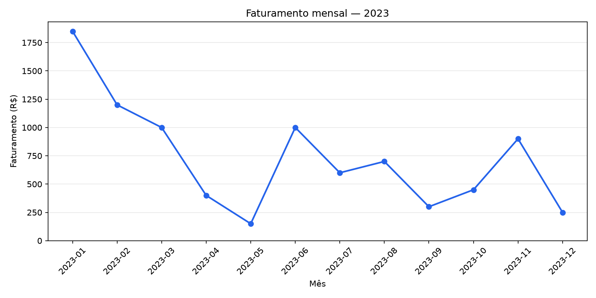
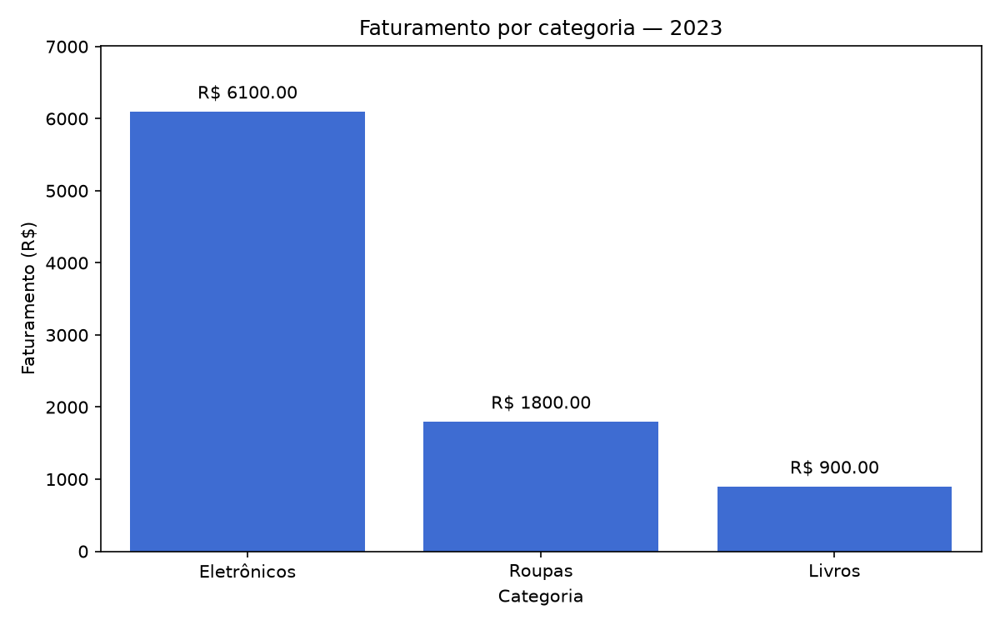

# Análise de vendas com Python

Projeto prático de ADS desenvolvido a partir da atividade de
Visualização de Dados em Python.

Utiliza uma base didática com 14 vendas de 2023, armazenadas em SQLite.

## Tecnologias

- Python
- SQLite
- Pandas
- Matplotlib
- Seaborn
- Git e GitHub

## Funcionalidades

- Criação do banco e da tabela de vendas.
- Carga dos dados de exemplo somente quando a tabela está vazia.
- Leitura dos dados com Pandas.
- Conversão das datas e verificação de valores ausentes.
- Cálculo do faturamento total, médio, mensal e por categoria.
- Geração e salvamento de gráficos.

## Como executar no Windows

Ambiente utilizado no desenvolvimento: Python 3.14.7.

No terminal, dentro da pasta do projeto:

```powershell
python -m venv .venv
.\.venv\Scripts\python.exe -m pip install -r requirements.txt
.\.venv\Scripts\python.exe main.py
```

O programa cria o banco `dados_vendas.db` e salva as imagens na
pasta `graficos`.

Feche a janela do gráfico mensal para visualizar o gráfico por categoria.

## Resultados

| Indicador | Resultado |
|---|---:|
| Quantidade de vendas | 14 |
| Faturamento total | R$ 8.800,00 |
| Valor médio por venda | R$ 628,57 |
| Eletrônicos | R$ 6.100,00 |
| Roupas | R$ 1.800,00 |
| Livros | R$ 900,00 |
| Maior faturamento mensal | Janeiro: R$ 1.850,00 |
| Menor faturamento mensal | Maio: R$ 150,00 |

## Gráficos

### Faturamento mensal



### Faturamento por categoria



## Conclusões

Eletrônicos representou aproximadamente 69,3% do faturamento.
A empresa poderia avaliar a disponibilidade desses produtos,
considerando também custos e margens antes de ampliar o estoque.

Janeiro apresentou o maior faturamento e maio, o menor.
Seria necessário investigar quantidade de vendas, campanhas e
disponibilidade de produtos para compreender essa diferença.

A base é pequena e didática. Os resultados não permitem afirmar
que existe um padrão sazonal nem identificar a categoria mais lucrativa.

## Verificações realizadas

- Reexecução sem duplicar a carga inicial de 14 vendas.
- Nenhum valor ausente após a conversão das datas.
- Soma dos faturamentos mensais igual ao total de R$ 8.800,00.
- Conferência visual dos dois gráficos.
